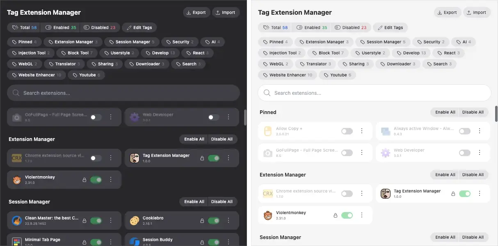

[](https://opensource.org/licenses/MIT)
[](https://github.com/gumob/TagExtensionManager)

# [Tag Extension Manager](https://github.com/gumob/TagExtensionManager)

A Chrome Extension for efficiently managing Chrome extensions. Group multiple extensions with tags and easily enable/disable them based on your needs.



## Features

### Core Features

- Intuitive tag-based extension management
- One-click tag switching
- Quick search by extension name
- Bulk enable/disable extensions by tag
- Individual tag toggle
- Tag management (create, delete, rename, reorder)
- Extension lock feature
- Modern and polished design
- Dark/Light mode support

### Extension Management

- View extension details
- Uninstall extensions
- Open extension options page
- Import/Export tagged extensions

## Installation

### From Chrome Web Store

1. Visit [Chrome Web Store](https://chromewebstore.google.com/detail/tag-extension-manager/mcnibmkpimlpgnlgkkhpgabkhdgngmca)
2. Click "Add to Chrome"
3. Click "Add Extension" in the confirmation dialog

### Development Version

1. Download [release version](https://github.com/gumob/TagExtensionManager/releases) and upzip
2. Open `chrome://extensions` in Chrome
3. Enable "Developer mode" in the top right
4. Click "Load unpacked"
5. Select the unzipped folder

## For Developers

### Development Setup

1. Install required tools

   - [Node.js](https://nodejs.org/) (v20 or higher)
   - [pnpm](https://pnpm.io/) (v10 or higher)
   - [mise](https://mise.jdx.dev/) (Development environment manager)

2. Clone the repository

   ```bash
   git clone https://github.com/gumob/TagExtensionManager.git
   cd TagExtensionManager
   ```

3. Install dependencies

   ```bash
   pnpm install
   ```

4. Start development server

   ```bash
   pnpm dev
   ```

5. Open `chrome://extensions` in Chrome
6. Enable "Developer mode" in the top right
7. Click "Load unpacked"
8. Select the `dist/dev` folder in the downloaded directory

### Using Fastlane

```bash
bundle exec fastlane
```

### Project Structure

For detailed project structure, please refer to [DIRECTORYSTRUCTURE.md](./DIRECTORYSTRUCTURE.md).

### Technology Stack

For detailed technology stack information, please refer to [TECHNOLOGSTACK.md](./TECHNOLOGSTACK.md).

### Development Guidelines

1. Code Style

   - Use ESLint and Prettier
   - Run `pnpm lint` before committing
   - Run `pnpm format` before committing

2. Branch Strategy

   - `main`: Production branch
   - `develop`: Development branch
   - Feature development: `feature/feature-name`
   - Bug fixes: `fix/bug-description`

3. Pull Requests
   - Clear title and description
   - Reference related issue numbers
   - Self-review before submission

### Building

```bash
# Production build
pnpm build

# Development build
pnpm dev
```

## 🔒 Privacy

We respect your privacy. All data is stored locally on your device. See our [Privacy Policy](./PRIVACY.md) for details.

## 📝 License

This project is licensed under the [MIT License](./LICENSE).
